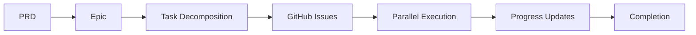
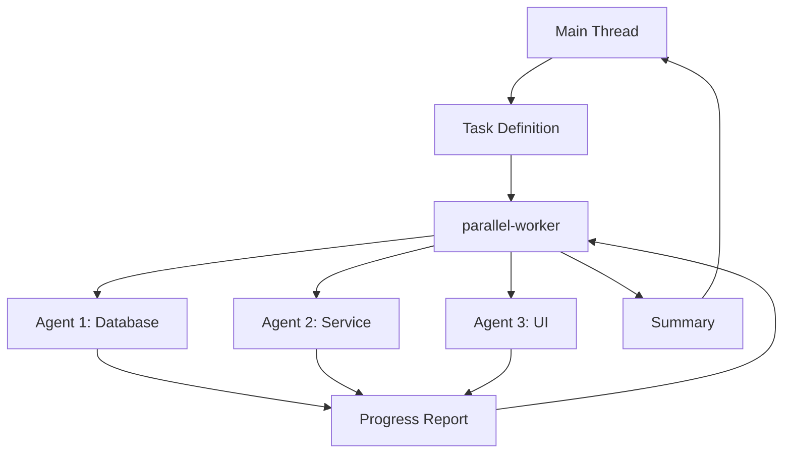
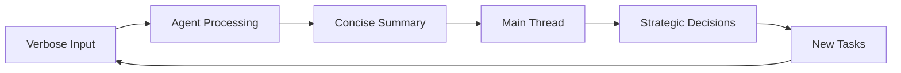

# System Patterns

## Architectural Patterns

### 1. Command-Driven Architecture
All interactions are initiated through slash commands (`/command:name`):
- **Pattern**: Command → Validation → Execution → Result
- **Implementation**: Markdown files with tool authorization
- **Benefits**: Consistent interface, clear audit trail
- **Use Cases**: Project management, context management, testing

### 2. Agent-Based Processing
Heavy work is delegated to specialized sub-agents:
- **Pattern**: Main thread → Task spawn → Agent execution → Summary return
- **Implementation**: Each agent has specific purpose and output pattern
- **Benefits**: Context preservation, parallel execution, isolation
- **Use Cases**: Code analysis, file processing, test execution

### 3. GitHub-Centric Data Store
GitHub Issues serve as the primary database:
- **Pattern**: Local work → GitHub sync → Team visibility
- **Implementation**: gh CLI with sub-issue extension
- **Benefits**: Native collaboration, audit trail, no lock-in
- **Use Cases**: Task tracking, progress reporting, team coordination

### 4. Context-First Design
Project knowledge is maintained in structured context files:
- **Pattern**: Create → Prime → Update → Repeat
- **Implementation**: Standardized markdown files in .claude/context/
- **Benefits**: Fast onboarding, maintained memory, consistency
- **Use Cases**: Project documentation, agent onboarding, knowledge sharing

### 5. Parallel Execution Model
Multiple work streams execute simultaneously:
- **Pattern**: Issue analysis → Work stream identification → Parallel execution → Merge
- **Implementation**: Git worktrees for isolation, agents for execution
- **Benefits**: 5-8x faster delivery, conflict prevention
- **Use Cases**: Complex features, multi-component changes

## Workflow Patterns

### 5-Phase Development Discipline
```
Brainstorm → Document → Plan → Execute → Track
```

1. **Brainstorm Phase** (`/pm:prd-new`)
   - Deep thinking beyond surface requirements
   - User story exploration
   - Success criteria definition

2. **Document Phase** (PRD creation)
   - Comprehensive specification
   - No interpretation needed
   - Complete requirements capture

3. **Plan Phase** (`/pm:prd-parse`)
   - Technical architecture decisions
   - Dependency mapping
   - Implementation strategy

4. **Execute Phase** (`/pm:issue-start`)
   - Parallel agent execution
   - Spec-driven implementation
   - Progress tracking

5. **Track Phase** (`/pm:sync`, `/pm:status`)
   - Transparent progress reporting
   - Issue state management
   - Team coordination

### Context Management Pattern
```
Create → Prime → Work → Update
```

- **Create**: Initial project documentation
- **Prime**: Load context for new session
- **Work**: Execute with full context awareness
- **Update**: Capture changes and progress

### Testing Integration Pattern
```
Prime → Run → Analyze → Fix
```

- **Prime**: Configure testing framework
- **Run**: Execute tests through test-runner agent
- **Analyze**: Understand failures without verbose output
- **Fix**: Implement fixes with full context

## Data Flow Patterns

### Issue Lifecycle Pattern


### Agent Communication Pattern


### Context Preservation Pattern


## Design Patterns

### 1. Strategy Pattern (Agents)
Different agents implement the same interface but specialize:
- All agents receive tasks and return summaries
- Each has specialized processing logic
- Main thread doesn't need to know implementation details

### 2. Command Pattern (Slash Commands)
Each command encapsulates a specific operation:
- Commands are self-contained markdown files
- Specify required tools in frontmatter
- Follow consistent structure and error handling

### 3. Observer Pattern (GitHub Sync)
Changes are propagated through the system:
- Local changes trigger sync events
- GitHub updates are reflected locally
- Team sees real-time progress

### 4. Template Method Pattern (Context Files)
Context files follow a standardized structure:
- Consistent frontmatter
- Organized sections
- Predictable content organization

### 5. Factory Pattern (Agent Spawning)
Agents are created based on task requirements:
- Task type determines agent selection
- Agents are configured with specific parameters
- Clean interface for agent management

## Anti-Patterns to Avoid

### 1. Direct Implementation
**Wrong**: Jumping straight to code without specifications
**Right**: Following 5-phase discipline with proper documentation

### 2. Context Pollution
**Wrong**: Main thread handling all implementation details
**Right**: Using agents to isolate verbose processing

### 3. Serial Execution
**Wrong**: One task at a time sequentially
**Right**: Identifying parallel work streams and executing simultaneously

### 4. Tool-Specific Dependencies
**Wrong**: Creating dependencies on specific tools or platforms
**Right**: Using standard technologies (Git, GitHub, Markdown)

### 5. Verbose Communication
**Wrong**: Returning all processed information to main thread
**Right**: Agents return concise summaries (10-20% of input)

## Integration Patterns

### 1. Language Agnostic
- No assumptions about programming language
- Works with any tech stack
- Adapts to project conventions

### 2. Git-Native
- Uses standard Git features
- No custom Git operations
- Compatible with existing workflows

### 3. GitHub Integration
- Leverages GitHub Issues as data store
- No separate databases required
- Native collaboration features

### 4. Claude Code Native
- Uses built-in Claude Code features
- No extensions or plugins required
- Works with any Claude Code project

## Performance Patterns

### 1. Lazy Loading
- Context loaded only when needed
- Agents spawned on demand
- GitHub sync only when requested

### 2. Caching
- Local context storage
- GitHub CLI caching
- Agent result caching within session

### 3. Parallel Processing
- Multiple agents work simultaneously
- No blocking operations
- Independent work streams

### 4. Incremental Updates
- Only sync changes, not full state
- Context updates are differential
- Progress tracking is incremental