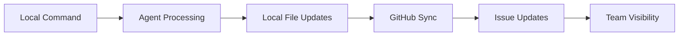
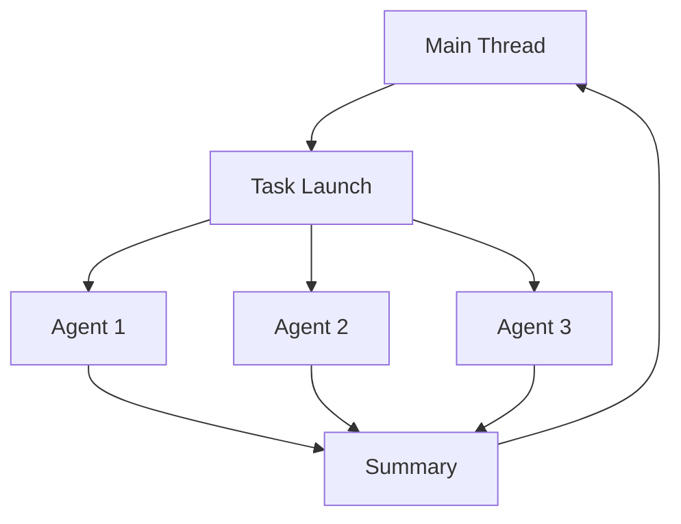

# Technical Context

## Core Technologies

### Primary Technology Stack
- **Markdown** - All documentation, commands, and specifications
- **Shell Scripts** (bash/PowerShell) - Installation and setup utilities
- **Git** - Version control and worktree management
- **GitHub CLI (gh)** - Issue management and synchronization

### No Runtime Dependencies
- Zero package dependencies (npm, pip, cargo, etc.)
- Pure documentation and workflow system
- Works with any programming language project

## System Requirements

### Development Environment
- **Git** - Required for worktree functionality
- **GitHub CLI (gh)** - Core dependency for issue management
- **gh-sub-issue extension** - For parent-child issue relationships
- **Curl/Wget** - For one-line installation
- **Terminal/Shell** - bash (Unix) or PowerShell (Windows)

### Claude Code Requirements
- Claude Code subscription (claude.ai/code)
- Access to Task tool for sub-agent spawning
- Standard tool set: Read, Write, Bash, Grep, Glob, etc.

## External Dependencies

### GitHub API
- Uses standard GitHub REST API
- No special repository configuration
- Works with public and private repositories
- Rate limits managed through gh CLI

### Installation Sources
- Primary: GitHub repository (automazeio/ccpm)
- Fallback: Raw CDN URLs
- No package managers required

## Configuration Files

### System Configuration
- No configuration files required
- All settings handled through commands and environment
- GitHub authentication managed by gh CLI

### Project Integration
- `.gitignore` - Should exclude `.claude/epics/` and `.claude/prds/`
- `CLAUDE.md` - Project-specific instructions for Claude
- Context files in `.claude/context/` for project knowledge

## Development Tools

### Command System
- **Slash commands** - All interactions start with `/`
- **Markdown-based** - Commands are interpreted from markdown files
- **Tool authorization** - Each command specifies allowed tools
- **Error handling** - Consistent error patterns and user guidance

### Agent Framework
- **Sub-agents** - Specialized for different task types
- **Context preservation** - Agents shield main thread from details
- **Parallel execution** - Multiple agents work simultaneously
- **Concise output** - 80-90% reduction in verbose information

### Testing Integration
- **Framework agnostic** - Works with any testing setup
- **test-runner agent** - Captures and analyzes test output
- **Verbose logging** - Tests run with detailed output for debugging
- **Fail-fast analysis** - Quick identification of test failures

## Security Considerations

### Authentication
- GitHub authentication through standard OAuth
- Tokens stored securely by gh CLI
- No credential storage in project files

### Data Privacy
- No telemetry or analytics collection
- All data stored locally or in user's GitHub
- No third-party services involved

### File Permissions
- Standard Unix/Windows file permissions
- No special privileges required
- Scripts run with user permissions

## Performance Characteristics

### Context Optimization
- **Agent isolation** - Implementation details don't pollute main thread
- **Summarization** - Agents return 10-20% of processed information
- **Parallel processing** - Multiple agents work simultaneously
- **Incremental sync** - Only sync changes to GitHub

### Scalability
- **Linear scaling** with number of parallel agents
- **No hard limits** on project size or complexity
- **Git-based** - Scales with GitHub's infrastructure
- **Local-first** - Most operations don't require network

## Integration Patterns

### GitHub Integration Pattern

### Agent Communication Pattern

## Deployment Considerations

### Installation Methods
1. **One-line install** - Direct from repository
2. **Manual install** - Copy .claude directory
3. **Repository clone** - Full clone for development

### Distribution
- Single repository contains entire system
- No build process required
- Works immediately after installation
- Cross-platform compatibility

## Monitoring and Debugging

### Debug Information
- Verbose agent output available in logs
- Clear error messages with suggested solutions
- Progress indicators for long-running operations
- Context file timestamps for tracking updates

### System Health
- GitHub connectivity checks
- Agent validation before spawning
- File permission verification
- Git repository validation